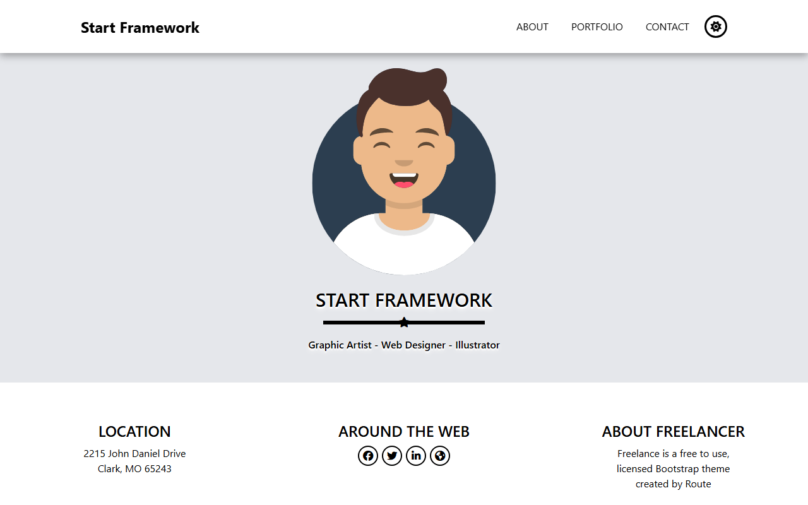

# Start Framework Portfolio

**A responsive multi-page portfolio web application built with React, React Router, and Tailwind CSS.**

**[Live Demo](https://shalabycode.dev/first-react-assignment/)** · **[Source](https://github.com/Shalabyelectronics/first-react-assignment)**



## About

This project is a responsive portfolio web application developed as the first React assignment for the Route Academy front-end curriculum. It adapts the classic Start Bootstrap "Freelancer" layout into a modern Single Page Application (SPA). The project focuses on core React fundamentals, reusable component architecture, client-side routing, and responsive mobile-first UI styling.

## Features

- **Client-Side Routing**: Multi-page navigation (Home, About, Portfolio, Contact) using React Router DOM with GitHub Pages basename routing.
- **Theme Toggle**: Light and dark mode support with state persistence in `localStorage`.
- **Portfolio Lightbox Modal**: Interactive gallery displaying a full-screen image overlay on card selection, complete with background scroll locking.
- **Responsive Layout**: Desktop navigation bar alongside an animated mobile slide-down menu and a collapsible mobile footer drawer.
- **Contact Form UI**: Clean contact form layout featuring interactive underline focus indicators.

## Built With

- **React 19**
- **React Router DOM 7**
- **Tailwind CSS v4** (via `@tailwindcss/vite`)
- **Vite**
- **Font Awesome Free** (vector icons)
- **gh-pages** (deployment)

## What I Learned

- Configuring nested route hierarchies and shared layouts using `createBrowserRouter` and `<Outlet />`.
- Managing dark mode state with `useState` and synchronizing changes to `document.documentElement` and `localStorage` using `useEffect`.
- Controlling modal display states, passing selected image data via props, and managing DOM side effects like scroll locking.
- Implementing responsive UI patterns with Tailwind CSS utility classes and transitions.

## Getting Started

### Prerequisites

Ensure you have [Node.js](https://nodejs.org/) installed on your machine.

### Installation

1. Clone the repository:
   ```bash
   git clone https://github.com/Shalabyelectronics/first-react-assignment.git
   cd first-react-assignment
   ```

2. Install dependencies:
   ```bash
   npm install
   ```

3. Start the development server:
   ```bash
   npm run dev
   ```

4. Build for production:
   ```bash
   npm run build
   ```

## Project Structure

```text
src/
├── assets/images/          # Graphic assets and portfolio preview images
├── components/
│   ├── About/              # About component section
│   ├── Contact/            # Contact form component
│   ├── Footer/             # Footer and mobile drawer
│   ├── Hero/               # Hero landing section with avatar
│   ├── Layout/             # Shared layout wrapper with Navbar & Footer
│   ├── Navbar/             # Header navigation and dark mode toggle
│   ├── Overlay/            # Modal overlay for portfolio image preview
│   ├── Portfolio/          # Portfolio gallery component
│   └── WebMap/             # Desktop footer info columns
├── App.jsx                 # Router configuration and layout routes
├── index.css               # Tailwind CSS imports and custom layer rules
└── main.jsx                # Application root entry
```

## Roadmap

- [ ] Add controlled form input state and validation to the contact form
- [ ] Add keyboard navigation support (Escape key to close modal)
- [ ] Connect contact form submission to a backend service or email handler
- [ ] Replace static portfolio previews with dynamic project descriptions and external links

## Author

**Mohamed Shalaby**

- Website: [shalabycode.dev](https://shalabycode.dev)
- GitHub: [@Shalabyelectronics](https://github.com/Shalabyelectronics)
- LinkedIn: [Mohamed Shalaby](https://www.linkedin.com/in/mhdshalaby/)
